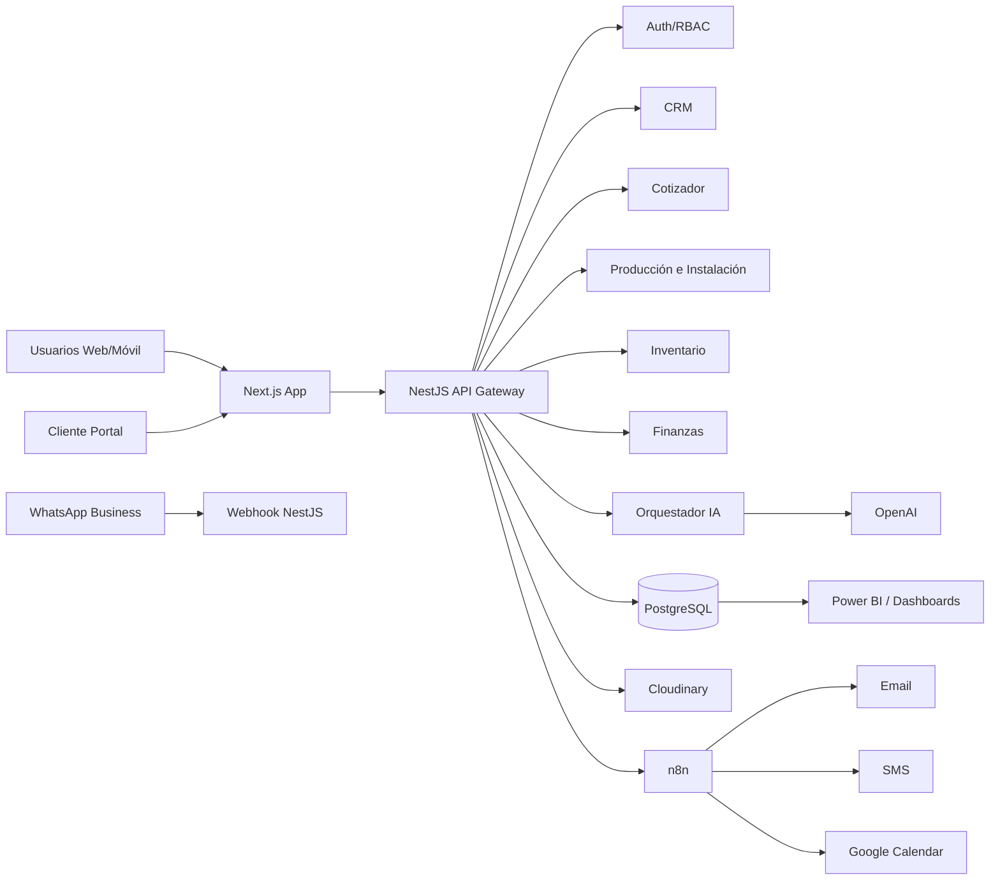
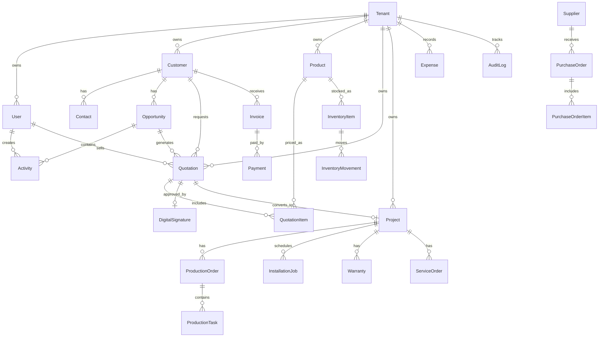
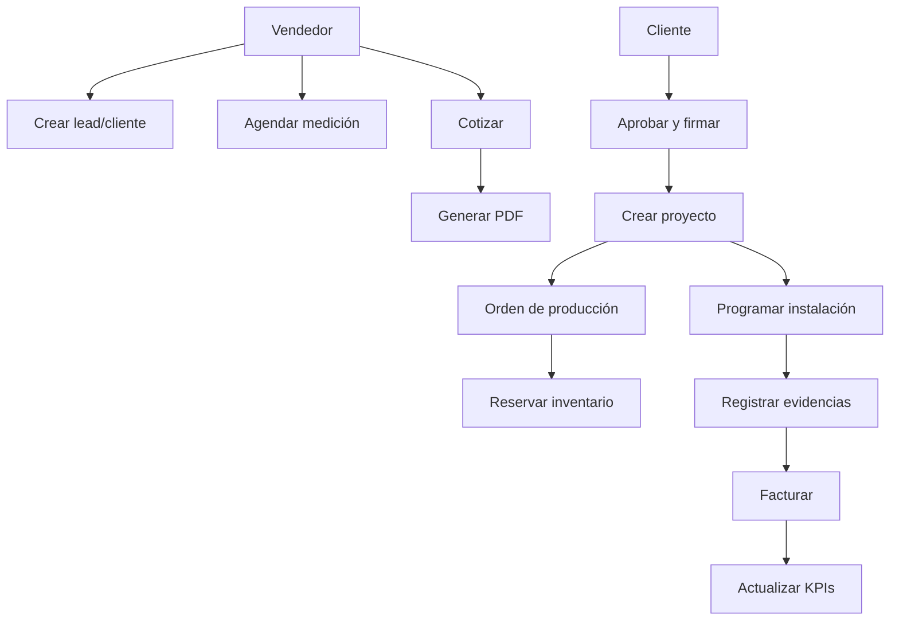
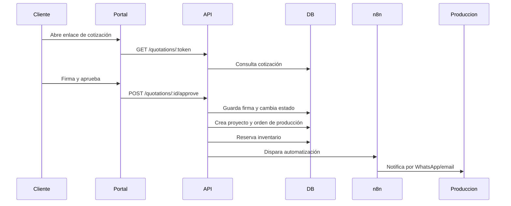
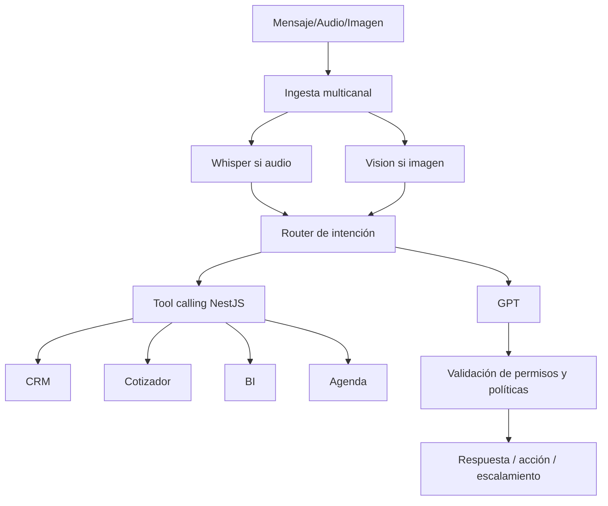

# Blueprint ERP + CRM + BI + IA para Decoraciones LopTorres

## 1. Visión del producto

La plataforma será un sistema empresarial modular para digitalizar la operación completa de empresas dedicadas a fabricación, venta, instalación, mantenimiento, lavado, motorización y automatización de cortinas y persianas a la medida.

**Propuesta de valor:** cotizar en menos de 2 minutos, convertir cotizaciones aprobadas en órdenes de producción, reservar inventario, programar instalación, controlar costos reales, medir rentabilidad y atender clientes mediante WhatsApp e IA.

**Principios de diseño:**

- Simple como Notion.
- Visual como Linear y Vercel.
- Comercial como HubSpot y PipeDrive.
- Operativo como Odoo, SAP Business One y ERPNext, pero especializado.
- Preparado para SaaS multiempresa.

## 2. Roles y permisos

| Rol | Responsabilidades | Permisos clave |
|---|---|---|
| Administrador | Configuración total | CRUD global, usuarios, permisos, integraciones, facturación SaaS |
| Gerente | Dirección del negocio | Dashboards, finanzas, reportes, aprobaciones, auditoría |
| Vendedor | Gestión comercial | Leads, clientes, cotizaciones, agenda, seguimiento |
| Diseñador | Propuestas visuales | Configurador, renders, catálogos, archivos de diseño |
| Instalador | Ejecución en campo | Agenda, rutas, evidencia fotográfica, firma cliente, materiales usados |
| Producción | Fabricación | Órdenes, estados, consumo de materiales, calidad |
| Bodega | Inventario | Entradas, salidas, traslados, reservas, mínimos, códigos QR |
| Contabilidad | Finanzas | Facturas, pagos, egresos, conciliación, cuentas por cobrar/pagar |
| Cliente | Portal externo | Aprobar cotizaciones, firmar, pagar, consultar estado, solicitar servicio |

Modelo recomendado: **RBAC + permisos granulares + políticas por tenant**.

## 3. Arquitectura del sistema

### 3.1 Stack propuesto

- **Frontend:** Next.js, React, TypeScript, Tailwind CSS, shadcn/ui, TanStack Query, Zustand.
- **Backend:** NestJS modular, REST primero, GraphQL opcional para BI/cliente.
- **Base de datos:** PostgreSQL.
- **ORM:** Prisma.
- **Autenticación:** JWT, refresh tokens, OAuth Google, 2FA TOTP.
- **Storage:** Cloudinary para fotos, videos, PDFs y evidencias.
- **Hosting:** Vercel para frontend, Railway para API y workers.
- **Automatización:** n8n para flujos externos y webhooks.
- **IA:** OpenAI GPT para razonamiento, Vision para fotos/medidas, Whisper para notas de voz.
- **Notificaciones:** WhatsApp Business Cloud API, email transaccional, SMS.
- **BI:** vistas materializadas PostgreSQL, Power BI embebido, endpoint de métricas.

### 3.2 Diagrama lógico



### 3.3 Módulos backend NestJS

1. AuthModule.
2. TenancyModule.
3. UsersModule.
4. CRMModule.
5. PipelineModule.
6. CatalogModule.
7. QuotationModule.
8. VisualConfiguratorModule.
9. DocumentModule.
10. SignatureModule.
11. ProductionModule.
12. InventoryModule.
13. PurchasingModule.
14. InstallationModule.
15. ServiceModule.
16. WarrantyModule.
17. FinanceModule.
18. BIAnalyticsModule.
19. AIModule.
20. NotificationModule.
21. IntegrationModule.
22. AuditModule.

## 4. Modelo entidad-relación ERD



## 5. Diseño de base de datos

### 5.1 Entidades principales

#### Tenancy y seguridad

- `tenants`: id, name, slug, plan, status, billing_email, created_at.
- `users`: id, tenant_id, name, email, phone, password_hash, google_id, status, last_login_at.
- `roles`: id, tenant_id, name, description.
- `permissions`: id, code, module, action.
- `role_permissions`: role_id, permission_id.
- `user_roles`: user_id, role_id.
- `audit_logs`: tenant_id, actor_id, entity, entity_id, action, before_json, after_json, ip, created_at.

#### CRM

- `customers`: tenant_id, type, name, document_type, document_number, email, phone, whatsapp, segment, source, status.
- `contacts`: customer_id, name, role, email, phone, is_primary.
- `addresses`: customer_id, label, address, city, latitude, longitude, notes.
- `opportunities`: tenant_id, customer_id, owner_id, stage, value, probability, expected_close_date, lost_reason.
- `activities`: tenant_id, opportunity_id, customer_id, assigned_to_id, type, channel, title, due_at, completed_at, notes.
- `documents`: tenant_id, entity_type, entity_id, file_url, file_type, name, uploaded_by_id.

#### Catálogo y cotización

- `categories`: tenant_id, name, parent_id.
- `suppliers`: tenant_id, name, contact_name, email, phone, payment_terms.
- `products`: tenant_id, category_id, supplier_id, sku, name, description, product_type, unit, cost, margin, price, tax_rate, fabrication_days, warranty_months, active.
- `product_variants`: product_id, fabric, color, brand, texture, opacity, image_url, catalog_url.
- `pricing_rules`: tenant_id, name, product_type, formula_json, min_price, waste_percentage, active.
- `quotations`: tenant_id, customer_id, opportunity_id, seller_id, project_name, address_id, status, subtotal, discount_total, tax_total, total, cost_total, profit_total, margin_percent, valid_until, notes.
- `quotation_items`: quotation_id, product_id, variant_id, room, window_label, quantity, width_m, height_m, area_m2, system, motor, accessories_json, unit_cost, unit_price, discount, tax, total, profit.
- `digital_signatures`: quotation_id, signer_name, signer_document, signature_url, signed_at, ip, approval_token.

#### Operación

- `projects`: tenant_id, customer_id, quotation_id, status, start_date, delivery_date, total_value, total_cost.
- `production_orders`: tenant_id, project_id, code, status, priority, due_date, assigned_to_id.
- `production_tasks`: production_order_id, type, status, started_at, finished_at, responsible_id, notes.
- `installation_jobs`: tenant_id, project_id, customer_id, assigned_team_id, scheduled_at, status, route_order, gps_lat, gps_lng, before_photos_json, after_photos_json, customer_signature_url, notes.
- `service_orders`: tenant_id, customer_id, project_id, type, status, scheduled_at, assigned_to_id, cost, price, notes.
- `warranties`: tenant_id, project_id, customer_id, start_date, end_date, status, cost, responsible_id, notes.

#### Inventario y compras

- `warehouses`: tenant_id, name, address.
- `inventory_items`: tenant_id, warehouse_id, product_id, sku, batch, quantity, reserved_quantity, min_quantity, unit_cost, barcode, qr_code.
- `inventory_movements`: tenant_id, inventory_item_id, type, quantity, reference_type, reference_id, reason, created_by_id, created_at.
- `purchase_requests`: tenant_id, requested_by_id, status, notes.
- `purchase_orders`: tenant_id, supplier_id, status, subtotal, tax, total, expected_at.
- `purchase_order_items`: purchase_order_id, product_id, quantity, unit_cost, total.

#### Finanzas

- `invoices`: tenant_id, customer_id, quotation_id, project_id, number, status, subtotal, tax, total, due_date.
- `payments`: tenant_id, invoice_id, method, amount, paid_at, reference.
- `expenses`: tenant_id, category, description, amount, tax, paid_at, payment_method, supplier_id, receipt_url.
- `bank_accounts`: tenant_id, name, bank, account_number, currency, balance.
- `cash_movements`: tenant_id, bank_account_id, type, amount, description, occurred_at.

## 6. Diagramas UML

### 6.1 Caso de uso principal



### 6.2 Secuencia de aprobación de cotización



## 7. Casos de uso

1. **Gestionar cliente:** crear, clasificar, adjuntar documentos, consultar historial y ubicación.
2. **Gestionar oportunidad:** mover por etapas, registrar llamadas, WhatsApp, visitas y seguimientos.
3. **Cotizar producto a medida:** ingresar medidas, producto, tela, color, motor, transporte e instalación.
4. **Aprobar cotización:** enviar PDF, recibir firma digital y pago inicial.
5. **Fabricar pedido:** crear orden, asignar etapas, registrar avance y control de calidad.
6. **Reservar inventario:** descontar telas, perfiles, motores y accesorios por orden.
7. **Instalar:** asignar técnico, ruta, hora, evidencia antes/después, firma y materiales usados.
8. **Gestionar garantía:** registrar reclamo, costo, responsable y vencimiento.
9. **Gestionar finanzas:** cobrar, pagar, registrar gastos, calcular utilidad y flujo de caja.
10. **Consultar asistente IA:** preguntar por ventas, rentabilidad, cartera, inventario y desempeño.

## 8. Historias de usuario priorizadas

### MVP imprescindible

- Como vendedor, quiero crear clientes y oportunidades para organizar el embudo comercial.
- Como vendedor, quiero cotizar cortinas a medida con ancho, alto, tela y accesorios para entregar precios en menos de 2 minutos.
- Como cliente, quiero recibir un PDF con botón de aprobación para aceptar fácilmente.
- Como gerente, quiero ver ventas, utilidad y cotizaciones pendientes para tomar decisiones diarias.
- Como producción, quiero recibir órdenes automáticas para fabricar sin reprocesos.
- Como bodega, quiero ver reservas y mínimos de inventario para evitar faltantes.

### V1

- Como instalador, quiero registrar fotos y firma desde celular para cerrar trabajos en campo.
- Como contabilidad, quiero gestionar facturas, pagos y cuentas por cobrar.
- Como gerente, quiero reportes de rentabilidad por proyecto, producto y vendedor.
- Como usuario, quiero sincronizar visitas con Google Calendar.

### V2

- Como cliente, quiero cotizar por WhatsApp conversacionalmente.
- Como vendedor, quiero que IA convierta texto o audio en cotizaciones.
- Como gerente, quiero predicción de ventas, compras e inventario.

### V3

- Como dueño SaaS, quiero planes, límites, facturación recurrente y onboarding multiempresa.
- Como empresa, quiero marketplace de integraciones y plantillas de automatización.

## 9. Backlog del producto

| Épica | Funcionalidades |
|---|---|
| Autenticación | Login, Google OAuth, JWT, refresh, 2FA, recuperación contraseña |
| Usuarios y permisos | Roles, permisos, auditoría, políticas por módulo |
| CRM | Clientes, contactos, direcciones, historial, documentos, GPS |
| Embudo | Etapas, oportunidades, tareas, actividades, motivos de pérdida |
| Agenda | Calendario, visitas, instalaciones, mantenimientos, recordatorios |
| Catálogo | Categorías, productos, variantes, proveedores, garantías, fotos |
| Cotizador | Reglas, medidas, accesorios, costos, margen, IVA, PDF, aprobación |
| Visualizador | Renders, color/tela, antes/después, galerías |
| Producción | Órdenes, etapas, responsables, calidad, tiempos |
| Inventario | Existencias, reservas, movimientos, mínimos, QR, barras, mermas |
| Compras | Solicitudes, órdenes, recepción, proveedores, pagos |
| Instalaciones | Técnicos, rutas, evidencias, firmas, materiales utilizados |
| Servicios | Lavado, mantenimiento, cambio motor, cambio tela, repuestos |
| Garantías | Registro, seguimiento, costos, responsables, vencimiento |
| Finanzas | Ingresos, egresos, caja, bancos, CxC, CxP, reportes |
| BI | Dashboards, KPIs, Power BI, predicciones |
| IA | Asistente, cotizador, análisis financiero, visión, voz |
| Integraciones | WhatsApp, email, SMS, Google Calendar, pagos, n8n |
| SaaS | Tenants, planes, límites, suscripciones, marca blanca |

## 10. Roadmap

### MVP, 8 a 12 semanas

- Login, roles básicos y tenant único.
- CRM básico.
- Catálogo de productos y variantes.
- Cotizador parametrizable.
- PDF profesional.
- Aprobación con firma digital.
- Dashboard ejecutivo inicial.
- Producción básica e inventario mínimo.

### V1, 3 a 5 meses

- Instalaciones móviles con fotos y firma.
- Finanzas, facturas, pagos, egresos y cuentas por cobrar.
- Compras y proveedores.
- Google Calendar.
- Reportes de rentabilidad.
- Auditoría completa y 2FA.

### V2, 6 a 9 meses

- WhatsApp Business bot.
- Cotizador IA por texto, audio e imagen.
- Power BI embebido.
- Predicciones de ventas, flujo de caja, demanda e inventario.
- Automatizaciones n8n avanzadas.

### V3, 9 a 15 meses

- SaaS multiempresa.
- Planes y facturación recurrente.
- Marketplace de plantillas.
- API pública.
- White-label.
- Multi-país, multi-moneda e impuestos configurables.

## 11. Wireframes principales

### 11.1 Login

```text
+------------------------------------------------+
| Logo LopTorres ERP                             |
| Email                                          |
| Contraseña                                     |
| [ Ingresar ]  [ Continuar con Google ]         |
| ¿Olvidaste tu contraseña?                      |
+------------------------------------------------+
```

### 11.2 Dashboard ejecutivo

```text
+ Sidebar + Header con búsqueda + Asistente IA    
| KPI Ventas día | Ventas mes | Utilidad | Caja |
| Gráfica ingresos vs egresos | Embudo comercial |
| Cotizaciones pendientes | Instalaciones hoy   |
| Inventario crítico | Alertas inteligentes  |
```

### 11.3 CRM cliente

```text
| Datos cliente | Segmento | WhatsApp | GPS |
| Timeline: llamadas, correos, visitas, cotizaciones |
| Oportunidades | Facturas | Garantías | Archivos |
```

### 11.4 Cotizador inteligente

```text
Paso 1 Cliente y proyecto
Paso 2 Ambientes y ventanas
Paso 3 Producto, tela, color, sistema, motor
Paso 4 Instalación, transporte, descuentos, IVA
Paso 5 Resumen: costo, precio, utilidad, margen
Panel derecho: simulación visual + total + botón PDF
```

### 11.5 Producción

```text
Kanban: Pendiente | Corte | Confección | Armado | Calidad | Terminado | Despacho
Tarjeta: proyecto, cliente, fecha, medidas, materiales, responsable
```

### 11.6 Instalador móvil

```text
Trabajo de hoy
Cliente / dirección / mapa / hora
Checklist
Fotos antes
Material usado
Fotos después
Firma cliente
Cerrar instalación
```

## 12. Diseño UI/UX

- **Paleta:** negro carbón, blanco, grises cálidos, acento dorado/cobre, estados semánticos.
- **Tipografía:** Inter o Geist.
- **Componentes:** cards con bordes suaves, tablas densas, kanban, command palette, drawer lateral.
- **Modo claro/oscuro:** tokens CSS con Tailwind.
- **Microinteracciones:** transiciones de 150-250 ms, skeleton loaders, toasts elegantes.
- **Responsive:** sidebar colapsable, navegación inferior en móvil para CRM, cotizaciones, agenda y perfil.
- **Accesibilidad:** contraste AA, navegación por teclado, labels claros.

## 13. API REST documentada

Base: `/api/v1`.

### Auth

- `POST /auth/login`
- `POST /auth/google`
- `POST /auth/refresh`
- `POST /auth/logout`
- `POST /auth/2fa/verify`

### CRM

- `GET /customers`
- `POST /customers`
- `GET /customers/:id`
- `PATCH /customers/:id`
- `GET /customers/:id/timeline`
- `POST /activities`
- `GET /opportunities`
- `PATCH /opportunities/:id/stage`

### Catálogo y cotización

- `GET /products`
- `POST /products`
- `GET /pricing-rules`
- `POST /quotations/calculate`
- `POST /quotations`
- `GET /quotations/:id`
- `POST /quotations/:id/pdf`
- `POST /quotations/:id/send`
- `POST /quotations/:id/approve`
- `POST /quotations/ai-draft`

### Operación

- `GET /projects`
- `GET /production-orders`
- `PATCH /production-orders/:id/status`
- `GET /installation-jobs`
- `PATCH /installation-jobs/:id/complete`
- `POST /service-orders`
- `POST /warranties`

### Inventario y compras

- `GET /inventory`
- `POST /inventory/movements`
- `GET /inventory/critical`
- `POST /purchase-orders`
- `PATCH /purchase-orders/:id/receive`

### Finanzas y BI

- `GET /dashboard/executive`
- `GET /reports/sales`
- `GET /reports/profitability`
- `POST /invoices`
- `POST /payments`
- `POST /expenses`

### IA y canales

- `POST /ai/assistant/query`
- `POST /ai/quote-from-text`
- `POST /ai/quote-from-audio`
- `POST /ai/analyze-photo`
- `POST /webhooks/whatsapp`
- `POST /webhooks/n8n`

## 14. GraphQL opcional

```graphql
type Query {
  executiveDashboard(range: DateRangeInput!): ExecutiveDashboard!
  customer(id: ID!): Customer
  quotation(id: ID!): Quotation
  project(id: ID!): Project
}

type Mutation {
  calculateQuotation(input: QuotationInput!): QuotationCalculation!
  approveQuotation(id: ID!, signature: SignatureInput!): Project!
  askAssistant(question: String!): AssistantAnswer!
}
```

## 15. Integraciones

### WhatsApp Business Cloud API

- Webhook para mensajes entrantes.
- Plantillas para cotización, aprobación, recordatorio, instalación y garantía.
- Escalamiento a asesor cuando haya baja confianza, reclamo o intención comercial compleja.

### Email

- Envío de PDF, facturas, recordatorios y reportes.
- Eventos de apertura/clic para CRM.

### Google Calendar

- Sincronización de visitas, mediciones, instalaciones, mantenimientos y lavados.
- Manejo de reprogramaciones y recordatorios.

### Pasarelas de pago

- Enlaces de pago para anticipo y saldo.
- Webhook de pago aprobado para actualizar factura y proyecto.

### n8n

- Flujos de aprobación, notificación, seguimiento, cobranza y postventa.
- Reintentos, colas y trazabilidad.

## 16. Motor de cotización parametrizable

### 16.1 Variables

- Área: `ancho_m * alto_m * cantidad`.
- Desperdicio/merma por producto.
- Costo tela, mecanismo, perfil, motor, accesorios, mano de obra, instalación, transporte.
- Margen por categoría, cliente, canal o vendedor.
- Precio mínimo por unidad.
- IVA e impuestos configurables.
- Descuentos con permisos.

### 16.2 Fórmula base

```text
area_base = ancho * alto * cantidad
area_facturable = max(area_base * (1 + merma), area_minima)
costo_materiales = area_facturable * costo_tela_m2 + costo_sistema + costo_motor + accesorios
costo_operativo = mano_obra + instalacion + transporte
costo_total = costo_materiales + costo_operativo
precio_sin_iva = max(costo_total / (1 - margen_objetivo), precio_minimo)
descuento = precio_sin_iva * descuento_pct
iva = (precio_sin_iva - descuento) * tasa_iva
total = precio_sin_iva - descuento + iva
utilidad = total_sin_iva - costo_total
margen = utilidad / total_sin_iva
```

### 16.3 Pseudocódigo

```ts
function calculateQuoteItem(input, rule) {
  const area = input.widthM * input.heightM * input.quantity;
  const billableArea = Math.max(area * (1 + rule.wastePct), rule.minimumAreaM2);
  const materialCost = billableArea * input.fabricCostM2 + input.systemCost + input.motorCost + input.accessoriesCost;
  const operationalCost = input.laborCost + input.installationCost + input.transportCost;
  const cost = materialCost + operationalCost;
  const netPrice = Math.max(cost / (1 - rule.targetMarginPct), rule.minimumPrice);
  const discount = netPrice * input.discountPct;
  const tax = (netPrice - discount) * input.taxPct;
  return { cost, netPrice, discount, tax, total: netPrice - discount + tax };
}
```

## 17. Arquitectura del agente de IA

### 17.1 Capacidades

- Cotizador por texto, audio e imagen.
- Consulta ejecutiva de KPIs.
- Asistente financiero.
- Bot de WhatsApp.
- Clasificación de intención y extracción de entidades.
- Resumen de historial del cliente.
- Recomendaciones de margen, productos y seguimiento.

### 17.2 Componentes



### 17.3 Guardrails

- La IA no modifica precios finales sin reglas y permisos.
- Toda cotización debe pasar por el motor determinístico.
- Acceso a datos filtrado por tenant y rol.
- Registro de prompts, herramientas usadas y resultado.
- Escalamiento humano para quejas, descuentos altos o baja confianza.

## 18. Dashboards ejecutivos

### Comercial

- Ventas día/mes/año.
- Cotizaciones pendientes, aprobadas y perdidas.
- Conversión por vendedor y etapa.
- Ticket promedio.
- Clientes nuevos y frecuentes.
- Productos más vendidos.

### Financiero

- Ingresos, egresos, utilidad bruta y neta.
- Flujo de caja real y proyectado.
- Cuentas por cobrar y por pagar.
- Facturas vencidas.
- Gastos por categoría.
- Rentabilidad por proyecto.

### Operativo

- Proyectos en fabricación.
- Órdenes por estado.
- Instalaciones programadas.
- Mantenimientos y lavados.
- Inventario crítico.
- Mermas.
- Cumplimiento de tiempos.

### Predictivo

- Forecast de ventas.
- Forecast de caja.
- Demanda por producto.
- Reposición recomendada.
- Alertas de proyectos en riesgo de pérdida.

## 19. Automatizaciones clave

### Cotización aprobada

1. Cambiar cotización a aprobada.
2. Crear proyecto.
3. Crear orden de producción.
4. Reservar inventario.
5. Programar instalación tentativa.
6. Crear factura o anticipo.
7. Enviar WhatsApp y correo al cliente.
8. Notificar producción y bodega.
9. Actualizar dashboard.
10. Agendar seguimiento postventa.

### Inventario crítico

1. Detectar cantidad disponible menor al mínimo.
2. Crear solicitud de compra.
3. Notificar bodega y gerencia.
4. Sugerir proveedor según histórico de precio y cumplimiento.

### Cobranza

1. Detectar factura vencida.
2. Enviar recordatorio amable.
3. Crear tarea para contabilidad.
4. Escalar si supera X días.

## 20. Seguridad, despliegue y escalabilidad

### Seguridad

- JWT de corta vida y refresh token rotativo.
- 2FA para administradores, gerentes y contabilidad.
- Cifrado TLS extremo a extremo.
- Hash de contraseñas con Argon2.
- Rate limiting por IP, usuario y tenant.
- Auditoría inmutable para entidades críticas.
- Backups automáticos diarios y retención por plan.
- Políticas de acceso por tenant en todas las consultas.

### Despliegue

- Frontend en Vercel con preview deployments.
- Backend NestJS en Railway.
- PostgreSQL administrado con backups.
- Workers para PDF, notificaciones, IA y sincronizaciones.
- Cloudinary para archivos.
- n8n en instancia separada o cloud.

### Escalabilidad

- Monolito modular al inicio.
- Separación posterior de workers y módulos intensivos.
- Colas para PDF, WhatsApp, email, IA y BI.
- Vistas materializadas para reportes.
- Cache Redis para sesiones, permisos y dashboards.
- Sharding por tenant solo en etapa avanzada.

## 21. Estrategia SaaS multiempresa

### Modelo multi-tenant

- `tenant_id` obligatorio en tablas operativas.
- Middleware de tenant por subdominio, dominio personalizado o encabezado firmado.
- Configuración por empresa: impuestos, moneda, unidades, logo, colores, plantillas PDF, reglas de precios.

### Planes sugeridos

| Plan | Público | Límites |
|---|---|---|
| Starter | Microempresa | 3 usuarios, 200 cotizaciones/mes, CRM y cotizador |
| Pro | Empresa en crecimiento | 15 usuarios, producción, inventario, finanzas, WhatsApp |
| Business | Operación avanzada | Usuarios ilimitados, BI, IA, automatizaciones, API |
| Enterprise | Corporativos | SSO, SLA, white-label, soporte dedicado |

### Métricas SaaS

- MRR, ARR, churn, ARPU.
- Activación: primera cotización creada.
- Conversión: cotización enviada a aprobada.
- Uso: cotizaciones/usuario/mes, automatizaciones ejecutadas.
- Retención: empresas activas semanalmente.

## 22. Métricas de éxito del negocio

- Tiempo promedio de cotización menor a 2 minutos.
- Reducción de errores de producción en 50%.
- Aumento de conversión de cotizaciones en 20%.
- Disminución de inventario agotado en 40%.
- Visibilidad diaria de utilidad por proyecto.
- Reducción de cartera vencida mediante automatización.

## 23. Recomendación de implementación inicial

Construir primero un **monolito modular** con Next.js y NestJS separados, pero con dominios de negocio claros. El MVP debe enfocarse en CRM, cotizador, PDF, aprobación, producción básica, inventario mínimo y dashboard ejecutivo. La IA y WhatsApp deben diseñarse desde el inicio como arquitectura, pero activarse por fases para evitar complejidad prematura.
